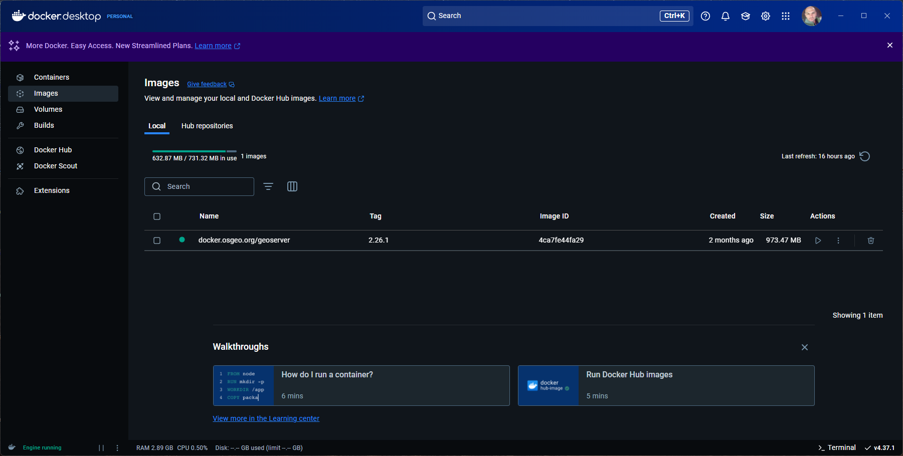
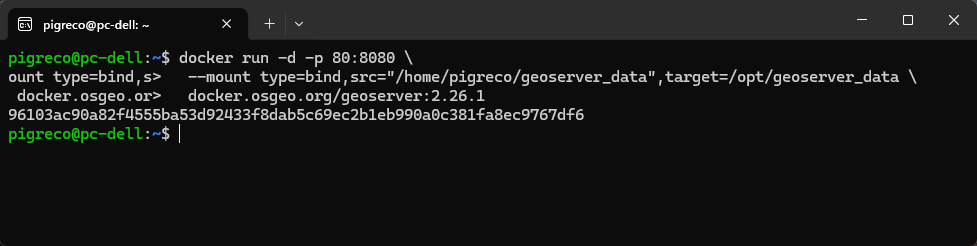

---
hide:
  - navigation
  # - toc
title: Avviare GeoServer
description: Avviare GeoServer da Docker
---

# Avviare GeoServer da Docker

## Verifica che Docker sia installato e attivo

Prima di eseguire qualsiasi comando Docker, assicurati che Docker sia installato e in esecuzione.

Su Windows:

- Apri Docker Desktop.
- Verifica che l'icona di Docker sia visibile nella barra delle applicazioni (Windows).
- Se Docker Desktop non è in esecuzione, avvialo manualmente.



## Avvia GeoServer
   
Una volta che Docker è in esecuzione, puoi avviare GeoServer (da una shell Linux) con il comando:

```bash
docker run -d -p 80:8080 \
  --mount type=bind,src="/home/pigreco/lavoro/geoserver",target=/opt/geoserver_data/ \
  docker.osgeo.org/geoserver:2.26.1
```



Spiegazione del comando:

`-d:` Avvia il container in modalità detached (in background).

`-p 80:8080:`

- Mappa la porta 80 del sistema host alla porta 8080 del container.
- Questo significa che potrai accedere a GeoServer all'indirizzo http://localhost:80/geoserver.

`--mount type=bind,src="/home/pigreco/geoserver_data",target=/opt/geoserver_data:`

- Monta la directory /home/pigreco/geoserver_data del sistema host nella directory /opt/geoserver_data del container.
- Questo consente di salvare i dati di configurazione di GeoServer in modo persistente.

`docker.osgeo.org/geoserver:2.26.1:` Utilizza l'immagine Docker di GeoServer versione 2.26.1.

Output del comando:

L'output `96103ac90a82f4555ba53d92433f8dab5c69ec2b1eb990a0c381fa8ec9767df6` è l'ID del container avviato. Puoi usare questo ID per gestire il container (es. fermarlo, riavviarlo, visualizzare i log).

Visualizza i log del container:

Se hai bisogno di verificare lo stato di avvio o risolvere eventuali problemi, puoi visualizzare i log del container con:

```bash
docker logs 96103ac90a82f4555ba53d92433f8dab5c69ec2b1eb990a0c381fa8ec9767df6
```

## Gestione Container

- Fermare il container: `docker stop <container_id_o_nome>`
  - ESEMPIO: `docker stop 96103ac90a82f4555ba53d92433f8dab5c69ec2b1eb990a0c381fa8ec9767df6`;
- Riavviare container: `docker start <container_id_o_nome>`
  - `docker start 96103ac90a82f4555ba53d92433f8dab5c69ec2b1eb990a0c381fa8ec9767df6`;
- Eliminare container: `docker rm <container_id_o_nome>`
  - `docker rm -f 96103ac90a82f4555ba53d92433f8dab5c69ec2b1eb990a0c381fa8ec9767df6`.
