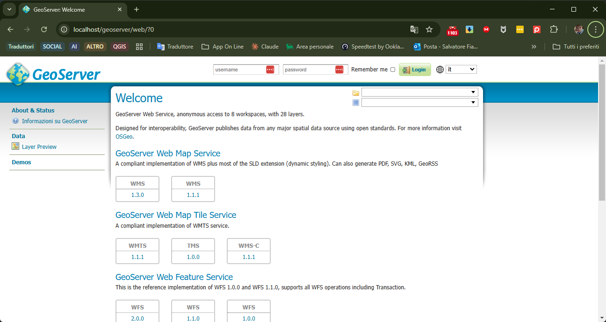

---
hide:
  # - navigation
  # - toc
title: Docker immagine geoserver
description: Docker immagine geoserver
---

# Docker immagine GeoServer

Per scaricare l'immagine Docker di GeoServer da **OSGeo**, puoi utilizzare il comando `docker pull` per ottenere l'immagine direttamente dal registro Docker di OSGeo. Ecco come fare:

---

### **1. Scaricare l'immagine GeoServer da OSGeo**
Apri un terminale (PowerShell su Windows, terminale su Linux/macOS) ed esegui il seguente comando:

```bash
docker pull docker.osgeo.org/geoserver:2.26.1
```

Spiegazione:
- `docker.osgeo.org/geoserver`: È il repository ufficiale di OSGeo per l'immagine Docker di GeoServer.
- `2.26.1`: È la versione specifica di GeoServer che vuoi scaricare. Puoi sostituirla con un'altra versione disponibile.

---

### **2. Verifica che l'immagine sia stata scaricata**
Dopo aver eseguito il comando `docker pull`, verifica che l'immagine sia stata scaricata correttamente:

```bash
docker images
```

Dovresti vedere un'immagine chiamata `docker.osgeo.org/geoserver` con il tag `2.26.1`.

---

### **3. Avviare un contenitore GeoServer**
Ora che hai scaricato l'immagine, puoi avviare un contenitore GeoServer. Ecco un esempio di comando:

```bash
docker run -d -p 80:8080 --name geoserver_container docker.osgeo.org/geoserver:2.26.1
```

Spiegazione:

- `-d`: Esegui il contenitore in modalità detached (in background).
- `-p 80:8080`: Mappa la porta 80 del sistema host alla porta 8080 del contenitore.
- `--name geoserver_container`: Assegna un nome al contenitore.
- `docker.osgeo.org/geoserver:2.26.1`: Specifica l'immagine da utilizzare.

---

### **4. Accedere a GeoServer**
Dopo aver avviato il contenitore, puoi accedere a GeoServer aprendo un browser e navigando verso:
```
http://localhost:8080/geoserver
```

Le credenziali predefinite sono:

- **Username**: `admin`
- **Password**: `geoserver`




---

### **5. Montare una cartella di dati (opzionale: per maggiori dettagli clicca [qui](montare_cartella_locale.md))**
Se vuoi montare una cartella del sistema host per memorizzare i dati di GeoServer, puoi utilizzare l'opzione `-v`:

```bash
docker run -d -p 80:8080 -v /path/nel/host:/opt/geoserver/data_dir --name geoserver_container docker.osgeo.org/geoserver:2.26.1
```

- Sostituisci `/path/nel/host` con il percorso della cartella sul tuo sistema host.
- I dati di GeoServer verranno memorizzati in `/opt/geoserver/data_dir` all'interno del contenitore.

---

### **6. Altre versioni di GeoServer**
Se vuoi scaricare una versione diversa di GeoServer, puoi specificare un altro tag. Ad esempio, per scaricare la versione `2.25.0`:

```bash
docker pull docker.osgeo.org/geoserver:2.25.0
```

---

### **7. Aggiornare l'immagine**
Se una nuova versione di GeoServer è disponibile, puoi aggiornare l'immagine scaricandola di nuovo con il comando `docker pull`:

```bash
docker pull docker.osgeo.org/geoserver:<nuova_versione>
```

---

### **Conclusione**
Hai scaricato l'immagine Docker di GeoServer da OSGeo e avviato un contenitore. Ora puoi utilizzare GeoServer per pubblicare e gestire i tuoi dati geospaziali.

<https://github.com/geoserver/docker>