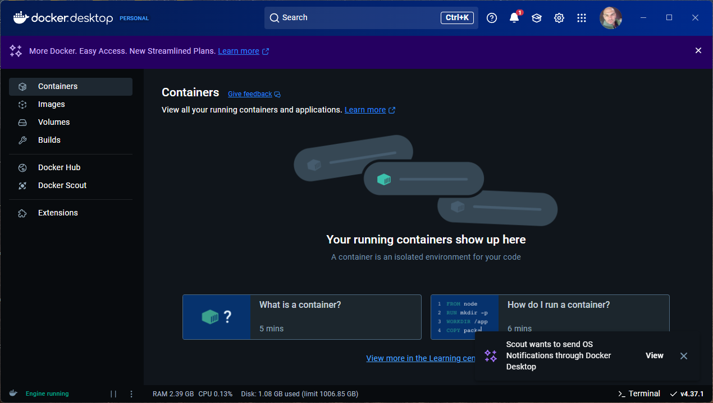
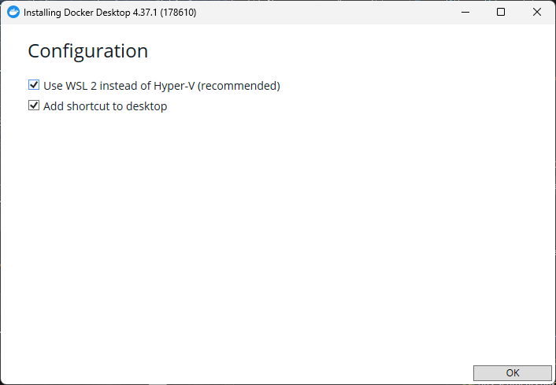

---
hide:
  # - navigation
  # - toc
title: Docker installazione
description: Docker installazione
---

# Docker installazione su Windows

Per installare Docker su Windows, segui questi passaggi. Docker su Windows richiede **Windows 10/11 Pro, Enterprise o Education** (edizioni a 64 bit) con supporto per la virtualizzazione. Se hai una versione Home di Windows, puoi comunque utilizzare Docker, ma con alcune limitazioni.

---

### **1. Verifica i requisiti di sistema**
- **Windows 10/11 Pro, Enterprise o Education** (edizioni a 64 bit).
- Abilitare la **virtualizzazione** nel BIOS/UEFI.
- Almeno **4 GB di RAM** (consigliati 8 GB o più).
- **Windows Update** aggiornato all'ultima versione.

---

### **2. Abilita la virtualizzazione**
1. Riavvia il computer e accedi al BIOS/UEFI (di solito premendo `F2`, `F10`, `DEL` o un altro tasto specifico del produttore durante l'avvio).
2. Cerca l'opzione per abilitare la virtualizzazione (spesso chiamata **Intel VT-x**, **AMD-V**, o **Virtualization Technology**).
3. Abilitala e salva le modifiche.

---

### **3. Installa Docker Desktop**
1. **Scarica Docker Desktop**:
   - Vai al sito ufficiale di Docker: [https://www.docker.com/products/docker-desktop](https://www.docker.com/products/docker-desktop).
   - Clicca su **"Download for Windows"**.

2. **Esegui il file di installazione**:
   - Apri il file scaricato (`Docker Desktop Installer.exe`).
   - Segui le istruzioni dell'installer.

3. **Configura Docker Desktop**:
   - Durante l'installazione, seleziona l'opzione **"Use the WSL 2 based engine"** (consigliato).
   - Se non hai WSL 2 (Windows Subsystem for Linux) installato, Docker ti chiederà di installarlo automaticamente.

4. **Completa l'installazione**:
   - Al termine dell'installazione, clicca su **"Close and restart"** per riavviare il computer.

---

### **4. Verifica l'installazione**
1. Dopo il riavvio, apri Docker Desktop dal menu Start.
2. Docker avvierà il demone e mostrerà l'interfaccia utente.
3. Apri un terminale (PowerShell o Prompt dei comandi) e verifica che Docker funzioni correttamente:
   ```bash
   docker --version
   ```
   Dovresti vedere la versione di Docker installata, ad esempio:
   ```
   Docker version 20.10.12, build e91ed57
   ```

4. Esegui un test con un'immagine di esempio:
   ```bash
   docker run hello-world
   ```
   Se tutto funziona correttamente, vedrai un messaggio di benvenuto da Docker.




---

### **5. Configura WSL 2 (opzionale ma consigliato)**
Se hai scelto di utilizzare WSL 2, Docker Desktop integrerà automaticamente WSL 2 per migliorare le prestazioni. Puoi verificare che WSL 2 sia attivo:

1. Apri PowerShell come amministratore.
2. Esegui il comando:
   ```bash
   wsl --list --verbose
   ```
   Dovresti vedere una distribuzione WSL (ad esempio, Ubuntu) con la versione **2**.



---

### **6. Utilizzare Docker Desktop**
- **Interfaccia grafica**: Puoi gestire contenitori, immagini, volumi e reti tramite l'interfaccia grafica di Docker Desktop.
- **Terminale**: Puoi utilizzare i comandi Docker da PowerShell, Prompt dei comandi o terminale WSL.

---

### **7. Risoluzione dei problemi comuni**
- **Errore "Docker Desktop is unable to detect a Hyper-V installation"**:
  - Verifica che Hyper-V sia abilitato. Apri PowerShell come amministratore e esegui:
    ```bash
    Enable-WindowsOptionalFeature -Online -FeatureName Microsoft-Hyper-V -All
    ```
  - Riavvia il computer.

- **Errore "WSL 2 installation is incomplete"**:
  - Installa manualmente WSL 2 seguendo le istruzioni ufficiali di Microsoft: [Installazione WSL](https://docs.microsoft.com/it-it/windows/wsl/install).

- **Docker non si avvia**:
  - Verifica che la virtualizzazione sia abilitata nel BIOS/UEFI.
  - Assicurati di avere i permessi di amministratore.

---

### **8. Aggiornare Docker Desktop**
Per aggiornare Docker Desktop:
1. Apri Docker Desktop.
2. Clicca sull'icona di Docker nella barra delle applicazioni.
3. Seleziona **"Check for Updates"**.
4. Segui le istruzioni per installare l'aggiornamento.

---

### **Conclusione**
Hai installato Docker su Windows! Ora puoi creare, eseguire e gestire contenitori per le tue applicazioni.
