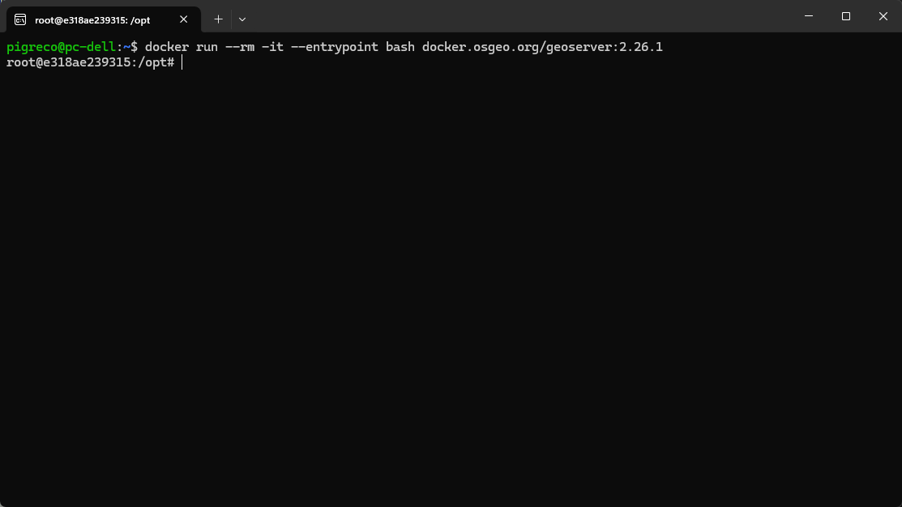
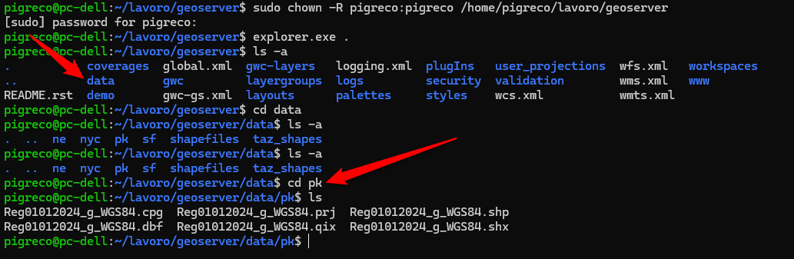
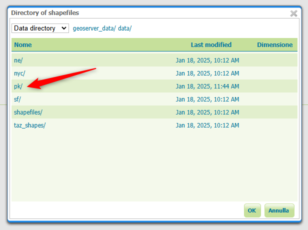

---
hide:
  # - navigation
  # - toc
title: Docker montare cartella
description: Docker montare cartella dati in locale
---

# Montare una cartella per utilizzare i propri dati

Durante l'installazione di Docker, vengono spesso inclusi dati di esempio per le demo. Tuttavia, se vuoi utilizzare i tuoi dati, è necessario creare una cartella locale e montarla nel contenitore Docker. Questo ti permette di condividere i dati tra il tuo sistema host e il contenitore.

## Procedura

### 1. **Avviare una shell nel contenitore**
Per esplorare il contenitore e preparare la cartella, avvia una shell interattiva:

```bash
docker run --rm -it --entrypoint bash docker.osgeo.org/geoserver:2.26.1
```

Questo comando avvia un contenitore temporaneo (`--rm`) e ti dà accesso a una shell (`bash`) all'interno del contenitore.



---

### 2. **Creare una cartella nel contenitore**
All'interno del contenitore, crea una cartella per memorizzare i dati di GeoServer. È consigliato utilizzare il percorso predefinito `/opt/geoserver_data`:

```bash
mkdir -p /opt/geoserver_data
```

---

### 3. **Creare una cartella nel filesystem host**
Crea una cartella sul tuo sistema host (ad esempio, in Linux) che verrà montata nel contenitore. Questo è il percorso in cui caricherai i tuoi dati.

Esempio:
```bash
mkdir -p /home/pigreco/lavoro/geoserver
```

---

### 4. **Avviare il contenitore con la cartella montata**
Per montare la cartella del sistema host nel contenitore, utilizza il comando `docker run` con l'opzione `--mount`:

```bash
docker run -d -p 80:8080 \
  --mount type=bind,src="/home/pigreco/lavoro/geoserver",target=/opt/geoserver_data/ \
  docker.osgeo.org/geoserver:2.26.1
```

Spiegazione:

- `-d`: Esegui il contenitore in modalità detached (in background).
- `-p 80:8080`: Mappa la porta 80 del sistema host alla porta 8080 del contenitore.
- `--mount type=bind,src="...",target="..."`: Monta la cartella del sistema host (`src`) nella cartella del contenitore (`target`).
- `docker.osgeo.org/geoserver:2.26.1`: Specifica l'immagine Docker da utilizzare.

---

### 5. **Impostare i permessi della cartella**
Assicurati che la cartella montata abbia i permessi corretti per essere accessibile da GeoServer. Ad esempio, se stai utilizzando Linux, puoi impostare i permessi con:

```bash
sudo chown -R pigreco:pigreco /home/pigreco/lavoro/geoserver
```

Questo comando assegna la proprietà della cartella all'utente `pigreco`.

---

### 6. **Aggiungere i dati alla cartella**
Ora puoi aggiungere i tuoi dati (ad esempio, shapefile, raster, ecc.) nella cartella montata (`/home/pigreco/lavoro/geoserver`). Questi dati saranno accessibili all'interno del contenitore nel percorso `/opt/geoserver_data`.



---

### 7. **Configurare GeoServer**

1. Accedi a GeoServer aprendo un browser e navigando verso:
   ```
   http://localhost
   ```
   (Se hai mappato la porta 80 del sistema host alla porta 8080 del contenitore.)

2. Usa le credenziali predefinite:
   - **Username**: `admin`
   - **Password**: `geoserver`

3. Vai alla sezione **"Data" > "Stores"** e configura un nuovo store per i tuoi dati.



---

### 8. **Verifica i dati**
Dopo aver configurato GeoServer, verifica che i tuoi dati siano accessibili e pubblicabili. Puoi creare layer, stili e visualizzare i dati sulla mappa.
